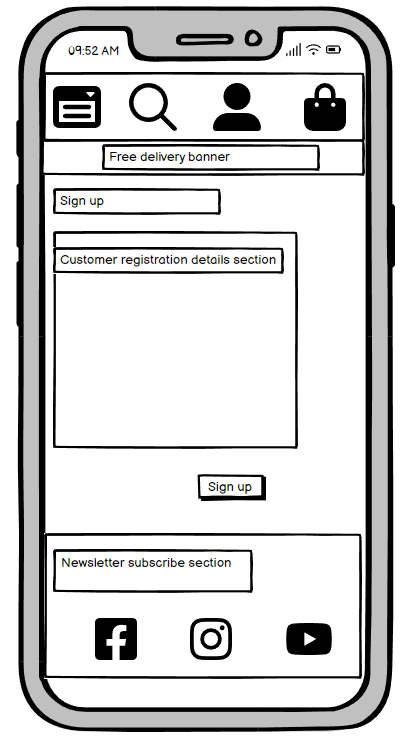
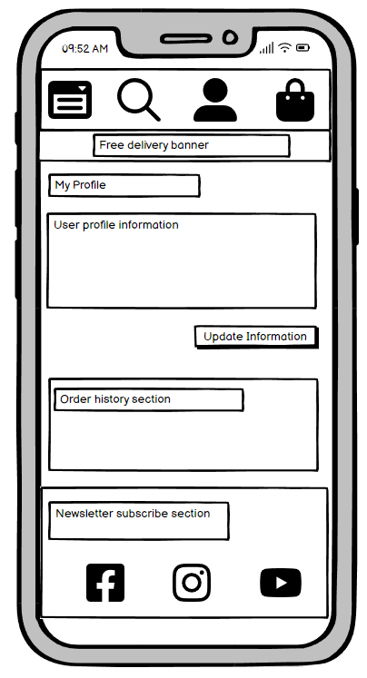
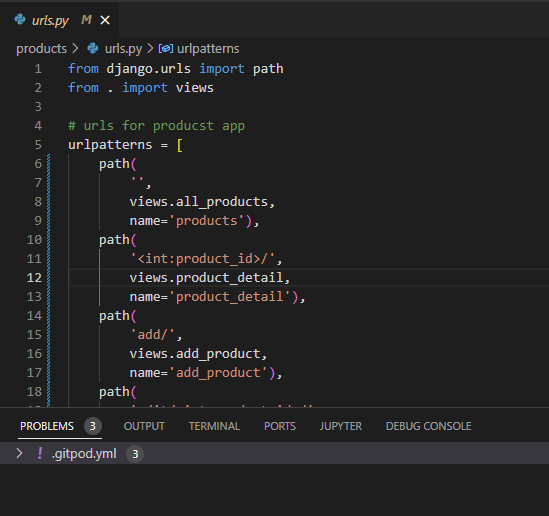
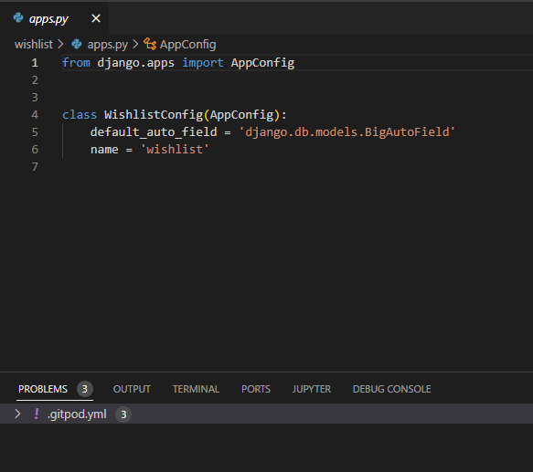
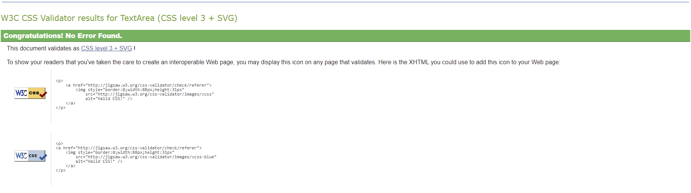

# Sneakerpoint
Sneaker marketplace for new and used sneakers.

Please visit the website [here](https://sneakerpoint.herokuapp.com/).

## Introduction and purpose

The Sneakerpoint e-commerce website has been developed as part of the Milestone project 5 for Code Institute Diploma in Software Development with eCommerce. The Sneakerpoint is an e-commerce applicationbuilt in Django, incorporating Python, CSS and HTML.

The application provides a fully functional solution for a e-commerce business selling new and used sneakers. Business owner and the admin of the application is able to manage products available throughout the website as well as users (Sneakpoint customers), orders and queries from customers.
The target audience of the site are users who look to purchase either new or used sneakers. Customers of Sneakerpoint are allowed to register and manage their user profiles as well as complete orders, including payment for the order.

## Design 

The below section of the document outlines development journey of the application starting from the concept to ultimate solution used to develop the site.

### 1 Concept

The concept of the project was to develop a fully functional e-commerce application, which would allow the business owner to run a business.
The business owner/site administrator is able to manage many of the functions via Django's admin portal however a functionality has been developed to allow site administrator to manage upload, edit and deletion of products via user interface. 
As for the target audience and ultimate users of the applications, are the customers interested in purchasing sneakers. In order to faciliate the process a customer profile can be created in order to retain key customer information such as address and contact details.

From a business point of view the desire was to develop an application, which would be user friendly, simple to use and browse the products as well as complete the purchase, using credit or debit cards.

### 2 Functional scope 

In terms of overall functional scope of the application the following key areas were needed to be developed in order for the site to operate as required:

**Site admin** - the primary means of managing the site from admin point of view is through a default admin portal supplied by Django's framework. With that said, the site admin is also allowed to manage products via user interface (Sneakerpoint site), whereby a product can be added, edited and deleted if necessary.

**Registration and Login**- site visitors and potential customers are invited to register via an option available in the navbar menu Customer Centre. The registration and login process is supported by Django's allauth solution. The registration process has been enhanced through email notifications, which users receive at the time of registration on the site.

**User Profile** - once registered customers can maintain and update their customer details, including address information. The profile also allows the users to view orders, which have been placed previously.

**Contact Us**- this functionality allows registered and unregistered site users to send queries to Sneakerpoint. The Contact Us is available through Customer Centre in the navbar and allows the users to submit query or a question they may have. Submissions are handled through a form available to users, and which requires user to provide their email address, subject and the actual message. Once the request is submitted users will receive confirmation that the query has been received. The actual queries are recorded in the database for site admin or the business owner to review and respond to client. The responses will need to be managed through an external email for now.

**Customer Reviews**- this functionality allows registered and logged in users to submit customer reviews. Once the user is logged in the user will be able to see their name and under the customer review will be logged under user's name. Whilst at the moment the customer reviews are recorded in the database, the actual customer reviews are only displayed to logged users.

**Wishlist**- this functionality allows registered and logged users to add products to their personal wishlist. Any products in user's wishlist can be reviewed further by clicking details button or alternatively products can be removed from the list at a click of a button. The wishlist functionality tracks all the users who have created a wishlist. In addition wishlists also tracks the individual products, which form part of users' wishlists.

**Bag** - this functionality allows customers to add products to a bag, should they decide to proceed and complete the purchase. Each addition of a product will update the bag and also provide user with a notificaiton message. Within the bag the user may take actions to update the quantity of product or remove them from the bag. The bag also allows the users to proceed to checkout section, where the purchase can be completed.

**Checkout**- this part of functionality allows the users to complete the purchase of product/s they have selected. As part of the checkout process, the user will be required to provide their details such as name, email address and a shipping address. Users will also need to provide credit card details in order to complete the purchase.

**Card payments**- the application incorporates credit card payment solution provided by Stripe in order to complete payments. The solution allows to provide real time feedback to customers in event if the credit card payment is rejected or the card number is incorrect. There are mutliple events, which Stripe will provide detailed feedback on to a user if required.

**Newsletter**- registered and unregistered users are able to provide their email address and sign up for a free newsletter from the business.

### 3 Solution 

In order to develop the application, and given the functional needs the following solutions were used:

**Languages**

Given the fact that the nature of the application allows for a frequent content manipulation, a standard HTML solution would not work.
The solution needed to incorporate Python in order to make the solution more agile, in terms of development of relevant functions and in order for the user actions to be able to interact with the database in place. 
As part of the development the following languages were used:
- HTML
- CSS
- Python
- Javascript

**Data and Database**

The Sneakerpoint application required a database structure, which would support managing various aspects of running the e-commerce business.
The key needs from database perspective were related to managing products, profiles/accounts, orders, customer queries, customer reviews and wishlist.
For the purpose of managing database related needs, ElephantSQL was selected as a solution for this project.

The data content was designed and organised as a relational database. The images and static files for application are stored in Amazon's AWS S3.

The below reflects database schema developed in order to support the needs of this project.

**Security**

In the course of application development the below security features have been incorporated:

- Django's allauth has been used for user registration and authentication management.
- Users who attempt to access retricted URLs, such as Product Management, and are not entitled to access this feature will be prompted to Login screen and will not be able to access the restricted feature.
- Payments for user purchases are securely processed using Stripe as payment management platform.
- CSRF token feature has been also utilised throughout the application to prevent unauthorised access and potential malicious attacks.

**Development**

For the purpose of development of this project a number of technologies were used. 

- GitHub repository was used to store the project's code after being pushed from Gitpod.
- Gitpod IDE was used for version control by utilizing the Gitpod terminal to commit and Push to GitHub.
- Django framework was used to develop structure of the application and also to use some of the already developed functions of Django such as user authorisation, admin portal and others.
- Bootstrap5 was used for construction of the application application and responsiveness.
- Crispy forms library 
- DrawSQL was used for drawing database schema.
- Balsamiq was used for creation of wireframes during the initial design process.
- Google Gmail for sending user emails.
- Heroku was used for hosting the application
- ElephantSQL was used to manage database of the application
- AWS was used for storing static files and product images.
- Mailchimp was used to manage collection of newsletter signups from users.

### 4 Wireframes 

In the the process of the application being designed the below wireframes have been drafted and put together.
Wireframes have been designed for both desktop and mobile views.

Desktop

 

Homepage

 
Products
 

 
Individual product details 
 

 
Sign up
 

 
Login
 

 
Logout
 

 
User Profile
 

 
Contact Us 
 

Wishlist 
 

 
Customer Review Submission 
 

 
Customer Reviews Summary 
 

 
Shopping Bag 
 

 
Checkout 
 

 
Product Management
 

 
 

Mobile

 

 Homepage  

 
Products
 

 
Individual product details 
 

 
Sign up
 

 
Login
 

 
Logout
 

 
User Profile
 

 
Contact Us 
 

Wishlist 
 

 
Customer Review Submission 
 

 
Customer Reviews Summary 
 

 
Shopping Bag 
 

 
Checkout 
 

 
Product Management
 

 

### 5 User Stories

The development of the project was based on User Stories created for the purpose of this project. The User stories were created and managed through a Kanban board available in GitHub. 
There were total of 19 User Stories which had been created for this development. The User Stories had been labelled accordingly to reflect 3 categories assigned such as: Must-Have, Should-Have and Could-Have. The progress in development was reflected in User Stories being moved from To Do, In Progress to Done section of the Kanban board. 

All of the User Stories for this project can be accessed [here](https://github.com/users/adamwasiak/projects/3/views/2).

### 6 E-commerce business model and marketing 

### Business model 

Sneakerpoint is a business to consumer e-commerce website offering its users (consumers) a platform to purchase sneakers, new and used. Consumers who wish to proceed with a purchase will be required to register and such users will avail of site functionality to store their shipping information and also details of previous orders.
Consumers who are visiting the site for the very first time are not required to register and can browse and access all information about the products across the Sneakerpoint site.As a modern day e-commerce site, Sneakerpoint allows users to purchase their prouducts using payment cards as a main and the only method of payment for now.
At the present, the business concept is limited to business to consumer model, whereas with time and site expansion the model could also include consumer to consumer. The latter would allow site users to offer their products (sneakers) to other consumers. The Sneakerpoint as a business, in such scenario would commercially benefit by applying a fee to each transaction.

### Marketing

The following marketing have been used in order to promote the business:

**SEO** - search engine optimazation has been also used including use of meta data in html structure, targeting the page word content with potential search on the web.
In addition robots.txt file and sitemap.xml have been both added to the structure of the application for enhanced search optimazation.

**Facebook business page** - a business page has been created on Facebook in order to increase engagement and outreach to potential customers. Facebook page will offer the business a direct engagement with potential customers and sneakers lovers across the globe.

**Newsletter** - Mailchmip has been used and linked to the application for the purpose of getting users and potential customers to sign up for business updates and promotions.

## User Experience

The Sneakerpoint e-commerce site has been developed with an aim to make the user experience pleasant, intuitive and simple in terms of site navigation.
The key objective was to make the site visually appealing for users through a combination of a balanced ratio between good sized images and essential use of text and buttons.

The below Features sections illustrates all the key features currently available to Sneakerpoint users.

## Features 

**Homepage**

Homepage includes welcome message and a button to access Sneakerpoint products.

**Navigation Bar, User Menu and Site Search**

Navigation bar allows user to select various options from Customer Centre menu, use the search option to locate products using specific word/s and also view total pending in the user's shopping bag at the point in time.

**Footer**

Footer includes links to Sneakerpoint's social medias as well as allows users to sign up for Sneakerpoint's newsletter.

**Products Page**

Products page will display rows of 4 products in each rown and allow the user to access more details about specific product by clicking on its image.
Products' prices, ratings and names are also included below each of the product's images.

**Individual Product Page**

Individual product's page will show the user product image, allow the user increase or decrease quantity of the products to be added to the shopping bag. 
Users will be also able to add the specific product to shopping bag or can use the button to continue to shop across the Sneakerpoint site.
Logged users will be also able to select product's size before adding it to the shopping bag.

**Shopping Bag**

In the shopping bag users are able to view previously added product/s and adjust quantity. Products can be also removed from the shopping bag by users. 
Users will be able to continue shopping by selecting related button or proceed to checkout.

**Checkout** 

In the checkout users will be able to view details of the product/s selected as well as the total value of the order.
Users will be asked to fill the details required for order processing, these include details of the user, delivery address and payment card details.

**User profile**

In the profile section users will be able to update their customer details including default delivery details.
Users will be also in position to access details of their previous orders.

**Contact Us**

Contact Us feature will allow users to contact Sneakerpoint business with any queries site users may have.

**Wishlist**

Wishlist feature will allow registered and logged user to add selected product/s to their wishlist. Upon clicking on the Wishlist option in the Customer Centre sections users will be able to see all the product/s they have added to their wishlist. Users will be able to access individual product details or remove them from the Wishlist.

**Customer Reviews**

Users will be able to submit their Customer Reviews. The feature of posting Customer Reviews is only available to registered and logged users.

**User Registration** 

New site users are able to complete related registration process using Register feature available in the Customer Centre section.

**User Login** 

Registered users will be able to login to Sneakerpoint site by using Login feature in the Customer Centre section.

**User Logout** 

Logged users will be able to logout from their profile by using Logout feature in the Customer Centre section.

**Admin Product Management** 

Sneakerpoint admin is add and modify products via User Interface by using Product Management feature available in the Customer Centre section. This feature is only available for superusers.

**Admin Portal** 

Sneakerpoint admin is able to access and manage the site via Django's admin portal.

## Future developments

The below outlines potential future developments in order to expand the current commercial business model:

- **User sales feature** - at the present Sneakerpoint business is based on the business to consumer model. This model will remain key generator of revenue for the Sneakerpoint business. With that said in order to attract a wider user base and also revenue stream, a feature allowing regsitered users to offer their products through Sneakerpoint marketplace will be also developed. Such approach would allow user community to sell their sneakers with an additional revenue stream for Sneakerpoint business, which would charge transaction fee per sale.

- **Sneaker blog** - another development in the pipeline is creation of a user forum, which would allow users to have discussions about sneakers, exchange their views and engage in a dialogue with other sneakers lovers. This feature would be an additional trigger to generate interest in the Sneakerpoint site across the web and bring additional users.

## Testing 

There has been an extensive testing completed prior to final deployment. The 2 key areas of testing were related to functional and code validation.

**Functional**

The functional testing has been completed manually and the test scenarios and the test results have been captured in the documents below. The document break the test scripts into a number of functional test groups. Overall testing has been successful, with only 1 aspect being identified as an issue. The issue has been noted in the unfixed bugs section below.

**Code validation testing**

SECTION CONTENT TO BE ADDED

**HTML code validation**

SECTION CONTENT TO BE ADDED

**Python code validation**

The code validation process using pycodestyle has returned the follwing results.

Python

 

 Bag apps.py
 

 
 Bag contexts.py
 

 
 Bag urls.py
 

 
 Bag views.py
 

 
 Checkout models.py 
 

 
 Checkout signals.py
 

 
 Checkout urls.py
 

 
 Checkout views.py
 

 
 Checkout webhandler.py
 

 
 Contact admin.py
 

 
 Contact apps.py
 

 
 Contact forms.py
 

 
 Contact models.py 
 

 
 Contact urls.py
 

 
 Contact views.py
 

 
 Products admin.py 
 

 
 Products apps.py
 

 
 Products forms.py
 

 
 Products models.py 
 

 
 Products urls.py
 

 
 Products views.py
 

 
 Products widgets.py
 

 
 Profiles models.py
 

 
 Profiles urls.py
 

 
 Profiles views.py
 

 
 Reviews admin.py
 

 
 Reviews apps.py
 

 
 Reviews models.py
 

 
 Reviews urls.py 
 

 
 Reviews views.py
 

 
 Settings
 

 
 Wishlist admin.py 
 

 
 Wishlist apps.py
 

 
 Wishlist models.py 
 

 
 Wishlist urls.py
 

 
 Wishlist views.py 
 

 

**CSS code validation**

The code validation process in Jigsaw CSS Validator has not highlighted code errors.

**base.css**

**checkout.css**

**profile.css**

**contact.css**

**Lighthouse – Dev Tools**

Lighthouse testing has been also completed for both, desktop and mobile.

*Desktop*

*Mobile* 

**Bugs**

The below section outlines details of some of the resolved bugs and also ones, which still remain unresolved.

 **Fixed Bugs**
 
The following bugs have been identified and subsequently fixed in the course of the project development:

- the Wishlist link in the Customer Centre section in the mobile view had an incorrect link incorporated and the application was not showing User's wishlist correctly. The issue has been resolved.

  
 **Unfixed Bugs**

The following bug remains unfixed:

- application footer section remains misaligned when browsing in desktop, and when visiting the following sections of Sneakerpoint application: Contact Us, Customer Reviews, Login and My Profile.
- there are number responsive design correction, which still need to be applied in order to improve user experience.
- submitted customer reviews are currently displayed to logged users and the format as they are displayed needs to be corrected and improved
 
## Deployment 

The application was deployed in Heroku. In addition a bucket was setup in AWS in order to store static files and media images.
Payments processing feature was implemented using Stripe as a payment platform. The database content was migrated from originally set up PostgreSQL to ElephantSQL.

Below sections outline in more details actions taken as part of the application deployment.

**Stripe**

1. Create account at stripe.com.
2. Access Developer section and go to API Keys section. 
3. Stripe secret key, public keysand webhook need to be copied into Heroku's confir vars section and in env.py in the development environment.
4. The above steps complete the require level of setup for Stripe to process payments successfully.

**ElephantSQL migration**

The below steps describe database migration from PostgreSQL to ElephantSQL. The reason for that is that initially the project has been setup in PostgreSQL and then a change to an alternative hosting service was required.

1. Login to ElephantSQL.com
2. Click on Create New Instance
3. Give your project a name and select Plan (Tiny Turtle Free) 
4. Set Region to EU-WEST-1 (Ireland)
5. Click on Create Instance
6. Return to Dashboard and click on the project name you have created
7. Subsequently a Postgres Migration Tool repo provided by Code Institute needed to be used
8. Once the tool was access and a new Gipod instance was opened, the following command was required: python3 reel2reel.py
9. Once the command was run, the DATABASE_URL value of the existing PostgreSQL database needed to be copied into Gitpod instance
10. DATABASE_URL value from ElephantSQL needed to be also copied into Gitpod instance (Postgres Migration Tool repo) to confirm the details of the new database where the existing database records and tables needed to be copied to.
11. Once all the steps have been taken the data and the data tables have been successfully copied.

**Amazon AWS S3**

1. Go to Amazon AWS site and create an account
2. Create a new S3 bucket for the site and create a static directory and media directory within the bucket
3. From the dashboard in Amazon AWS the following information will need to be copied into setting.py file in the development environment:
- Storage Bucket Name
- Storage Bucket Region Name
- Access Key ID
- Secret Access Key
- Custom Domain 
4. In env.py file in the development environment the below values will need to be added:
- os.environ["AWS_ACCESS_KEY_ID"] = 'your access key value'
- os.environ["AWS_SECRET_ACCESS_KEY"] = 'your secret access key value'
5.In Heroku in the config vars section AWS Access Key ID and AWS Secret Access Key values will need to be also added.

**Heroku**

1. Log in to Heroku or create an account to be able to login.
2. From the main Heroku Dashboard page select 'New' and then 'Create New App'.
3. Provide a project name. The name for the app must be unique. This will create the app within Heroku.
4. In Heroku's settings sections there is a sub section called Config Vars, and which will require the following values to be included:
- AWS_ACCESS_KEY_ID- this value is obtained from Amazon AWS service. The same value is included in env.py file.
- AWS_SECRET_ACCESS_KEY- this value is obtained from Amazon AWS service. The same value is included in env.py file.
- DATABASE_URL- this value is obtained from ElephanSQL service. The same value is included in env.py file.
- EMAIL_HOST_PASS- this value is obtained from Mailchimp service. 
- EMAIL_HOST_USER- this value is obtained from Mailchimp service. 
- SECRET_KEY- this value is included in env.py file.
- STRIPE_PUBLIC_KEY- this value is obtained from Stripe service. The same value is included in env.py file.
- STRIPE_SECRET_KEY- this value is obtained from Stripe service. The same value is included in env.py file.
- STRIPE_WH_SECRET- this value is obtained from Stripe service.
- USE_AWS- set to True
5. Once all the Config Vars are correctly configured and aligned with repository, go to Deploy tab in Heroku. In this section Github repository can be connected to. Once connected, the deployment can be initiated by clicking on Deploy Branch.
6. The process of building the application will be visible to a user in Heroku’s UI and any potential issues will be flagged.
7. Once the build is completed Heroku will confirm completing the task.

## Credits

- The theme of the application is influenced by Code Institute's walkthrough project Boutique Ado
- Products and frontpage images were acquired from unsplash.com
- Thank you to my mentor Daisy for continuous support and guidance.

